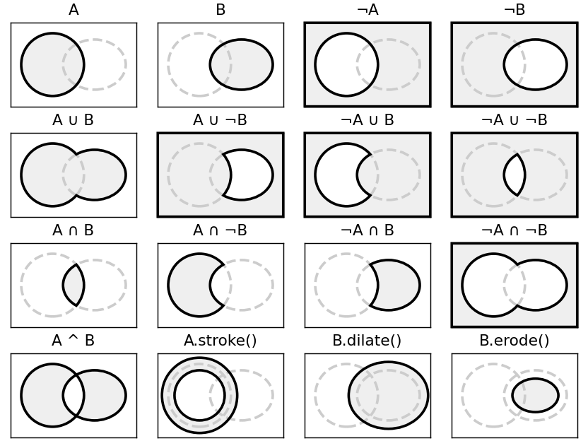

Welcome to mpl_skia_pathops's documentation!
===================================================================

A helper module that lets you use skia-pathops with Matplotlib's paths.

Installation
^^^^^^^^^^^^^

.. code-block:: bash

   pip install mpl_skia_pathops

Getting Help
^^^^^^^^^^^^

If you have a question on how to do something with ``mpl_skia_pathops`` a great place
to ask it is: https://discourse.matplotlib.org/c/3rdparty/18.

.. toctree::
   :maxdepth: 3

   examples/index
   Contributing

Indices and tables
==================

* :ref:`genindex`
* :ref:`modindex`
* :ref:`search`
